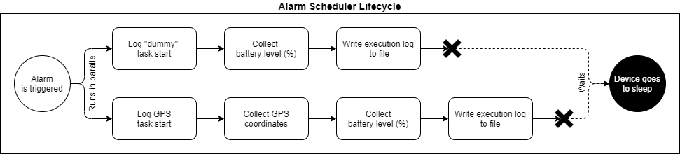

# NativeScript Task Dispatcher

[](https://www.npmjs.com/package/nativescript-task-dispatcher)
[](https://www.npmjs.com/package/nativescript-task-dispatcher)
[](https://travis-ci.com/GeoTecINIT/nativescript-task-dispatcher)

NativeScript Task Dispatcher is a NativeScript plugin aimed to ease the execution of mobile app's task definition and execution workflows in the background, regardless of whether the app is visible to the user or not.

It abstracts all the platform-specific details, leaving a clear and easy-to-use, yet powerful, API for task development and the definition of dependencies between them by means of an event-driven software architecture.

This plugin uses native mechanisms to carry out its function. All the code becomes executed in the main thread, we don't use web workers. It is not intended to free the main thread from intensive workloads, but rather to allow tasks to be performed while the user is not actively using the application.

## How does it work?

This plugin bases its way of working in three software primitives:

- **Tasks:** Small pieces of software meant to do only one job. Examples of tasks are:
  - A software fragment in charge of reading data from a sensor (e.g. user location).
  - Another code fragment in charge of doing some processing with the collected measurement (e.g. calculate the distance to a concrete venue).
  - Also, user-visible actions, like a code snippet in charge of regularly delivering a notification to the user informing about the distance to the venue.
- **Task graph:** A semantic way of describing how tasks relate to each other. Which tasks depend on an external event (an event not generated by a task) being triggered or in the output (in form of an event) of another tasks. Also, which tasks will be triggered by time events like:
  - At a certain time
  - In a certain amount of minutes
  - In a recurrent interval
  - At a certain time and in a specified recurrent interval since that time
- **Task schedulers:** These are completely transparent to the user of the plugin, right now there are two schedulers and another three planned:

  - _> 1 minute tasks' scheduler (Android only):_ An alarm-based task scheduler. In charge of running tasks whose execution window falls in a minute or more in the future.
  - _Event-driven tasks' scheduler (Android/iOS **[Planned]**):_ Ensures tasks triggered by external events in the background (e.g. a change in the activity of the user, a server-sent event, a system event, etc.) to reliably run while the app is not visible to the user. The Android version is fully functional, iOS version is on our roadmap (**PRs are welcome!**)
  - _Immediate tasks' scheduler (Android/iOS):_ in charge of running tasks that have to run with zero delay. This scheduler is in charge of running tasks whose execution has been triggered by another task. Requires another scheduler to be already running, i.e. a time-based scheduler or an event-driven one. The process of bootstrapping the required scheduler is completely transparent to the developer and the user.
  - _**(Planned)** < 1 minute tasks' scheduler (Android only):_ A background service-based tasks scheduler. That will be in charge of running time-critical tasks that need to run below a 1-minute period (e.g. tasks running every 15 seconds). **If you need to run a task below a 1-minute period, see `highFrequencySubTasks` in [Quick start](#quick-start).**
  - _**(Planned)** Delayed tasks' scheduler (iOS only):_ Will allow running time-triggered tasks in iOS. We cannot make any promises about its time accuracy or its possibilities. We are still studying how to implement this (**PRs are welcome!**)

To illustrate how the three aforementioned components link together, let's present the following simple (yet relatively complex) use case. Let's say that we want to wake-up our app every minute. To run a dummy task, collect the battery level of the device and log the task execution. In parallel, we want to follow the same workflow but with a task that collects user location, another task which collects battery level and finally another tasks that logs the execution of the whole pipeline branch. The following figure depicts the whole process:



Here **_> 1 minute tasks' scheduler_** and **_Immediate tasks' scheduler_** take place. The first scheduler bootstraps both task chains every minute, running them in parallel and waiting for them to finish before putting the device again to sleep. The task which logs the execution of a task chain depends on the battery (%) collection task successfully finishing in order to run. At the same time, battery level collection task won't run if the dummy task, or the GPS task don't run before.

## Prerequisites

### Android

Plugin supports devices running Android 4.2 Jelly Bean (SDK 17) to Android 10 Q (SDK 29). Given that this plugin supports last Android 10 changes in foreground services, **Android Build Tools 29.x.x+ is required**.

### iOS

**This plugin does not support iOS at its full extent**. In order to enable iOS support, this plugin requires a mechanism able to schedule tasks in time. We are evaluating how to do that, but cannot make any promises about when this functionality will be available. Sadly, it is not our priority to give a solution to this soon, but PRs are welcome in order to address this shortcoming.

## Installation

Run the following command in your project's root folder:

```javascript
tns plugin add nativescript-task-dispatcher
```

### Android-specific steps

#### Running tasks in foreground

If one or more of your app tasks have to run in the foreground (while in background), for example if one of your tasks requires accessing user location on a regular basis (more than once per hour) while in background ([more info here](https://developer.android.com/about/versions/oreo/background-location-limits)), please ensure the following keys become included in your app's `strings.xml` file (located in: `App_Resources -> Android -> src -> main -> res -> values`):

> **Note**: If your application does not yet include a `strings.xml` file inside the values folder. Please, copy the auto-generated file present inside `platforms -> android -> app -> src -> main -> res -> values` folder to the folder mentioned above. Please keep in mind that this structure won't be present in your project if you have not built your app yet.

```xml
<?xml version="1.0" encoding="utf-8"?>
<resources>
  <!--> Other strings <-->

  <!-->
    The notification channel used in Android 8.0 or higher to deliver foreground service sticky notifications.
    (more info here: https://developer.android.com/training/notify-user/channels)
  <-->
  <string name="task_dispatcher_channel_name">"Background location"</string>
  <string name="task_dispatcher_channel_description">"Indicates when the app is accessing your location in background"</string>
  <!-->
    The notification title and content that your user will see in the status bar while the service is running in foreground.
    (more info here: https://developer.android.com/guide/components/services#Foreground)
  <-->
  <string name="task_dispatcher_notification_title">"demo app is using your location"</string>
  <string name="task_dispatcher_notification_content">""</string>

  <!--> Other strings <-->
</resources>
```

#### Want to run tasks at intervals below _15 minutes_? See here.

This plugin has been highly optimized to get over one of the biggest shortcomings in Android, **running tasks reliably at < 15 minute intervals** (and >= 1 minute) without resorting to always running battery-consuming background services.

In order to do so, first you'll have to check if you meet one of the requirements to be whitelisted by the OS as an app that does not have to be bothered by the system's energy optimizer: [https://developer.android.com/training/monitoring-device-state/doze-standby#whitelisting-cases](https://developer.android.com/training/monitoring-device-state/doze-standby#whitelisting-cases)

If your meets the requirements to be whitelisted, then you'll need to add the following permission in your app's AndroidManifest.xml file (located in: `App_Resources -> Android -> src -> main`):

```xml
<?xml version="1.0" encoding="utf-8"?>
<manifest xmlns:android="http://schemas.android.com/apk/res/android"
	package="__PACKAGE__" ...>

	<uses-permission android:name="android.permission.REQUEST_IGNORE_BATTERY_OPTIMIZATIONS"/>

</manifest>
```

We'll handle the rest for you :)

> **Note**: Certain phone manufacturers include a non-stock Android layer in their phones, i.e. Samsung, Huawei, Xiaomi, to mention a few of them. This custom Android layer does not allow disabling battery savings by means of system APIs. If you're aware of that your users use devices from these brands, they will be required to adjust phone settings manually in order for the plugin to work reliably at below 15-minute intervals. [Here](./docs/disable-android-battery-saving.md) you will find further instructions.

> **Disclaimer**: Google regularly checks its store for apps that have declared the indicated permission. If you claim that your app should be whitelisted but in the end it turns out not, your app could end up banned from the Play Store. We advise you to thoroughly evaluate this.

## Usage

### Quick start

First of all you'll need to start defining some tasks and make them globally accessible. As a matter of an example, here you can see some tasks that we have defined for our demo app (located in: `demo/app/tasks/index.ts`):

```ts
// tasks.ts;
import { Task, SimpleTask } from "nativescript-task-dispatcher/tasks";
import { toSeconds } from "nativescript-task-dispatcher/utils/time-converter";

export const appTasks: Array<Task> = [
  // The "hello world" of the tasks
  new SimpleTask("fastTask", async ({ log }) => log("Fast task run!")),
  // A task which takes 2 seconds to complete
  new SimpleTask(
    "mediumTask",
    ({ log, onCancel }) =>
      new Promise((resolve) => {
        const timeoutId = setTimeout(() => {
          log("Medium task run!");
          resolve();
        }, 2000);
        onCancel(() => {
          clearTimeout(timeoutId);
          resolve();
        });
      })
  ),
  // A really slow task, which takes 30 seconds to complete
  new SimpleTask(
    "slowTask",
    ({ log, onCancel }) =>
      new Promise((resolve) => {
        const timeoutId = setTimeout(() => {
          log("Slow task run!");
          resolve();
        }, 30000);
        onCancel(() => {
          clearTimeout(timeoutId);
          resolve();
        });
      }),
    // Simulate that this task requires a visible UI element in order to run without problems (a foreground service with sticky notification in Android)
    { foreground: true }
  ),

  // A task meant to be run repeatedly at different rates
  // (always incrementing in 1 the number of minutes between executions).
  // This can be taken as an starting point for retry strategies.
  new SimpleTask("incrementalTask", async ({ params, log, runAgainIn }) => {
    const execCount = params.execCount ? params.execCount : 1;
    const execTime = toSeconds(execCount, "minutes");

    log(`Incremental task: Task run after ${execTime} seconds`);

    runAgainIn(toSeconds(execCount + 1, "minutes"), {
      execCount: execCount + 1,
    });
  }),

  // A task to run tasks that need to run bellow a 1 minute period.
  // Simulates a task that needs to run another task every 5 seconds.
  // The task uses remainingTime() to know when the execution window is ending.
  new SimpleTask("highFrequencySubTasks", async ({ remainingTime }) => {
    new Promise((resolve) => {
      const interval = 5000;
      const intervalId = setInterval(() => {
        console.log("SubTask executed");
        //remainingTime is calculated in every execution
        if (remainingTime() < interval) {
          clearInterval(intervalId);
          resolve();
        }
      }, interval);
    });
  }),
];
```

Explanation of the example tasks:

- **fastTask:** A task that just runs. The "hello world" of the tasks. It has zero temporal cost and complexity. Runs and logs something.
- **mediumTask:** An example of a task which takes a barely small amount of time to do some work. It uses NativeScript `setTimeout()` proxy to simulate that the task is running for 2 seconds.
- **slowTask:** An example of a task which takes a life to complete. It simulates a slow behavior, like when the location provider is taking more time than usual to get a coordinate fix. Aside from this, this task also declares that requires a foreground execution context in order to run without issues.
- **incrementalTask:** A task meant to cumulatively delay its execution after each run.
- **highFrequencySubTasks**: A task which job is to execute sub-tasks that need to run below a 1-minute period. This is an alternative solution to the _< 1 minute tasks' scheduler **(Planned)**_ for executing tasks at < 1 minute frequency.

Next you will need a way to describe how all the defined tasks work together. In order to do so, you will have to define your app's task graph. Again, as a mater of an example, we have created an example task graph in the demo application for you (located in: `demo/app/tasks/graph.ts`):

```ts
// graph.ts;
import {
  TaskGraph,
  EventListenerGenerator,
  RunnableTaskDescriptor,
} from "nativescript-task-dispatcher/tasks/graph";

class DemoTaskGraph implements TaskGraph {
  async describe(
    on: EventListenerGenerator,
    run: RunnableTaskDescriptor
  ): Promise<void> {
    // Time triggered tasks
    on("startEvent", run("fastTask").every(1, "minutes").cancelOn("stopEvent"));
    on(
      "startEvent",
      run("mediumTask").every(2, "minutes").cancelOn("stopEvent")
    );
    on("startEvent", run("slowTask").every(4, "minutes").cancelOn("stopEvent"));

    // Event-driven tasks
    on("slowTaskFinished", run("mediumTask"));
    on("mediumTaskFinished", run("fastTask"));

    // Example about how to run incrementalTask
    // on("startEvent", run("incrementalTask").in(1, "minutes"));
  }
}

export const demoTaskGraph = new DemoTaskGraph();
```

Explanation of the task graph:

- _By time the external event "startEvent" gets triggered_ 3 tasks instances become scheduled to run:
  - **fastTask** every minute
  - **mediumTask** every two minutes
  - **slowTask** every four minutes
- _After 1 minute_ **fastTask** runs immediately and logs its message through the console
- _After 2 minutes_ **fast and medium tasks** run. **fastTask** runs immediately, **mediumTask** takes 2 seconds to run. After **mediumTask** finishes, **fastTask** runs again. Then, the device goes to sleep.
- _After 3 minutes_ **fastTask** runs again
- _After 4 minutes_ **fast, medium and slow tasks** run. **fastTask** runs immediately, **mediumTask** takes 2 seconds to run and **slowTask** takes 30 seconds to run. After **mediumTask** finishes, **fastTask** runs again. After **slowTask** finishes, **mediumTask** runs again and takes 2 seconds to run, after those 2 seconds, **fastTask** runs for a third time in this task chain. Then, the device goes to sleep.
- And so on, _until the external event "stopEvent" gets triggered_. By this time, all scheduled tasks get cancelled and no task runs from here, due the event driven nature of the task graph.

As you can see, task graphs can get as complicated as you want (or need, for your application). There are some [limitations](#limitations) though.

> **Note**: By default all the tasks produce an event with the format: `{task-name}finished` upon completion. This behavior can be overridden in order to generate custom events.

The next thing to do is to initialize the task's dispatcher singleton object globally passing by the previously-defined app tasks and task graph. You will have to do that in app's `app.ts` file (or `main.ts` file in an Angular application):

```ts
// app.ts / main.ts
// TypeScript App:
import * as app from "tns-core-modules/application";
// or Angular App:
import { platformNativeScriptDynamic } from "nativescript-angular/platform";
import { AppModule } from "./app/app.module";

// NativeScript Task Dispatcher plugin imports
// (always between imports and app initialization)
import { taskDispatcher } from "nativescript-task-dispatcher";
import { appTasks } from "./tasks";
import { demoTaskGraph } from "./tasks/graph";

taskDispatcher.init(appTasks, demoTaskGraph, {
  // Recommended, to see debug and info messages while developing
  enableLogging: true,
});

// TypeScript App:
app.run({ moduleName: "app-root" });
// Angular App:
platformNativeScriptDynamic().bootstrapModule(AppModule);
```

Finally, you'll need to decide where does your app generate the external event that starts your task graph. As a matter of an example, in our demo app it is placed inside `home-page.ts` (home page's controller). We emit the `"startEvent"` when the user navigates to this view:

```ts
// home-page.ts
import { taskDispatcher } from "nativescript-task-dispatcher";

import { NavigatedData, Page } from "tns-core-modules/ui/page";
import { HomeViewModel } from "./home-view-model";

export function onNavigatingTo(args: NavigatedData) {
  const page = <Page>args.object;

  page.bindingContext = new HomeViewModel();

  emitStartEvent();
}

async function emitStartEvent() {
  const isReady = await taskDispatcher.isReady();
  if (!isReady) {
    const tasksNotReady = await taskDispatcher.tasksNotReady;
    console.log(`The following tasks are not ready!: ${tasksNotReady}`);
    await taskDispatcher.prepare();
  }
  taskDispatcher.emitEvent("startEvent");
}
```

## API

### taskDispatcher - Methods

Plugin's entry point. A singleton instance that can be used as needed throughout your app.

| Name                                                                          | Return type            | Description                                                                                                                                                                                                                                                                                                                                                                                                                                                                                          |
| ----------------------------------------------------------------------------- | ---------------------- | ---------------------------------------------------------------------------------------------------------------------------------------------------------------------------------------------------------------------------------------------------------------------------------------------------------------------------------------------------------------------------------------------------------------------------------------------------------------------------------------------------- |
| `init(appTasks: Array<Task>, appTaskGraph: TaskGraph, config?: ConfigParams)` | `Promise<void>`        | Allows to initialize the plugin with your own custom tasks and a task graph to describe how do they relate to each other. In order for the plugin to work, **it must be called only once** at your app's entry point (`app.ts` or `main.ts`). Through the configuration you can enable library's info and debug logging and also inject your custom logger which will inherently enable library's logging.                                                                                           |
| `isReady()`                                                                   | `Promise<boolean>`     | Allows to check (and wait for) plugin initialization status. It also iterates over your app's tasks to check if they are [ready](https://github.com/GeoTecINIT/nativescript-task-dispatcher/blob/master/src/internal/tasks/task.ts#L107) for its execution. You should call this method before emitting any external event. The promise is stored internally, it is safe to call this method as many times as needed.                                                                                |
| `tasksNotReady` _(property)_                                                  | `Promise<Array<Task>>` | Method to be called if isReady() returns false. Here you can check the tasks that did not pass the ready check. Useful in case you want to customize te UI before calling prepare(). For example, to give an explanation to the user of why you are asking his/her consent                                                                                                                                                                                                                           |
| `prepare()`                                                                   | `Promise<void>`        | Method to be called if isReady() returns false. If your app has one or more tasks that have reported not to be ready, it will call their [prepare()](https://github.com/GeoTecINIT/nativescript-task-dispatcher/blob/master/src/internal/tasks/task.ts#L114) method (e.g. to ask for missing permissions or enable disabled capabilities). **WARNING! This method is only meant to be called while the UI is visible.** Follow this guideline to foster the creation of a consistent task ecosystem. |
| `emitEvent(name: string, data?: EventData)`                                   | `void`                 | A fire and forget method. Call this method whenever you want to propagate an external event towards the plugin. Dependant tasks will be executed inside a safe environment. User can safely navigate to another app, we bootstrap a safe execution context to ensure it completes its life-cycle (we guarantee a maximum of 3 minutes execution time). Optionally, You can provide an additional key-value data dictionary that will be delivered to the task getting the event                      |

### Task ([see code](https://github.com/GeoTecINIT/nativescript-task-dispatcher/blob/master/src/internal/tasks/task.ts#L10))

A low level construct that allows the definition of code fragments meant to be executed independently of your app's view. It is an abstract class, which means that it is not meant for being instantiated, but to be extended instead. It is a powerful yet complex class and because of that we recommend you to use [SimpleTask](#simpletask-see-code) class instead for simpler operations (as its name implies).

There is a scenario where extending the Task class makes more sense than using a SimpleTask. If your task requires of certain conditions to be met in order to successfully run, you should create a new class which inherits from the Task class and override certain methods as follows:

```ts
// data-provider-task.ts
import {
  Task,
  TaskConfig,
  TaskParams,
  TaskOutcome,
} from "nativescript-task-dispatcher/tasks";
import { DispatchableEvent } from "nativescript-task-dispatcher/events";

export class DataProviderTask extends Task {
  constructor(
    name: string
    // Inject task dependencies here. e.g.:
    // private dataProvider: DataProvider
  ) {
    const taskConfig = {
      // Declare the name of the event(s) that the task can emit on result
      outputEventNames: ["dataAcquired"],
      // If empty or undefined, all tasks declare a default output event:
      // {taskName}Finished
    };
    super(name, taskConfig);
  }

  async checkIfCanRun(): Promise<void> {
    // e.g.:
    // await this.dataProvider.checkIfAppHasPermission();
  }

  async prepare(): Promise<void> {
    // e.g.:
    // await this.dataProvider.askPermission();
  }

  protected async onRun(
    params: TaskParams,
    invocationEvent: DispatchableEvent
  ): Promise<void | TaskOutcome> {
    let data = {};
    // e.g:
    this.setCancelFunction(() => {
      // Gracefully stop data acquisition if task gets cancelled. e.g.:
      //this.dataProvider.stopDataAcquisition();
    });
    // data = await this.dataProvider.acquireData();

    return { result: data };
    // A task emits an event on return. If a task can only emit one event
    // there is no need to specify the event to be emitted, but you can
    // anyway do it. Like this:
    // return { eventName: "dataAcquired", result: data };

    // Any other task invoked by "dataAcquired" event will find the captured
    // "data" inside invocationEvent.data. If data is a non-object value (e.g.
    // a string), it will be accessible from invocationEvent.data.result

    // If a task can emit one or more events, you must specify which event has
    // to be emitted otherwise task will fail to finish its execution correctly

    // A task can return no data. In that scenario, if the task can only emit
    // one kind of event, once onRun method ends its execution the event will
    // be fired, containing no data. If a task which returns no data can emit
    // more than one event. It will have to return the event name like this:
    // return { eventName: "dataAcquired" };
  }
}
```

#### Methods to override when extending Task class

| Name                                                                | Return type                   | Description                                                                                                                                                                                                                                                          |
| ------------------------------------------------------------------- | ----------------------------- | -------------------------------------------------------------------------------------------------------------------------------------------------------------------------------------------------------------------------------------------------------------------- |
| `constructor(name: string, taskConfig?: TaskConfig)`                | `void`                        | Override task constructor to inject external dependencies or to perform actions at instantiation time.                                                                                                                                                               |
| `onRun(taskParams: TaskParams, invocationEvent: DispatchableEvent)` | `Promise<void | TaskOutcome>` | Override this method to describe your task's logic. It can return nothing or a result to be used by other tasks. See Task example snippet above for more information.                                                                                                |
| (optional) `checkIfCanRun()`                                        | `Promise<boolean>`            | Override this method if your task cannot if some conditions are not met. This method will be called while calling taskDispatcher.isReady() method. As an example, you can perform permission checks here.                                                            |
| (optional) `prepare()`                                              | `Promise<boolean>`            | Override this method to define all the actions that must be executed in order to allow your task to run without issues. **UI code is allowed!** As an example, you can ask for permissions here. The UI is supposed to be visible by the time this method is called. |

> **Note:** We highly discourage you to **not to override other Task class methods** aside of the listed in the table above. _Things could go really wrong._

#### Properties available while extending Task class

| Name               | Type            | Description                                                                                        |
| ------------------ | --------------- | -------------------------------------------------------------------------------------------------- |
| `name`             | `string`        | The name of the task.                                                                              |
| `outputEventNames` | `Array<string>` | All the events the task has declared at build time that will emit at some moment of its execution. |

#### Methods available while extending Task class

| Name                                               | Return type | Description                                                                                                                                                                                                                                                                                                                                                                                                              |
| -------------------------------------------------- | ----------- | ------------------------------------------------------------------------------------------------------------------------------------------------------------------------------------------------------------------------------------------------------------------------------------------------------------------------------------------------------------------------------------------------------------------------ |
| `setCancelFunction(f: () => void)`                 | `void`      | Because of OS restrictions your task could end up being stopped at some moment if it takes too long to execute. Use this method to pass by a function to define actions to be performed in case your task has to finish its execution earlier than expected. You can cancel requests here or save partial results to start from the saved progress when the task gets invoked again.                                     |
| `runAgainIn(seconds: number, params?: TaskParams)` | `void`      | Schedule task to run again in a certain amount of seconds. Task params can be redefined. **WARNING! Calling this method from inside recurrent tasks could lead to unexpected results**. Always use this method in tasks declared as non-repeating.                                                                                                                                                                       |
| `remainingTime()`                                  | `number`    | Returns the remaining time that the task has to run. Useful when your taks has a recurrent behaviour over time, such as gathering GPS, accelerometer, gyroscope, etc. Use this method to know how much time is left for your task in order to manage and distribute the time among its several actions.                                                                                                                  |
| `log(message: any)`                                | `void`      | Allows you to log info messages and tie them to the task name and the task invocation id which is propagated from one task to another inside task's invocationEvent. If you set a custom [Logger](https://github.com/GeoTecINIT/nativescript-task-dispatcher/blob/master/src/internal/utils/logger/common.ts#L1) at plugin's initialization time, all log() method calls will pass through your logger as info messages. |

### SimpleTask ([see code](https://github.com/GeoTecINIT/nativescript-task-dispatcher/blob/master/src/internal/tasks/simple-task.ts#L6))

A higher level (and simpler) version of the [Task](#task-see-code) construct. It enforces functional programming principles to declare tasks as functions within a class object container. All the interaction with the simple task is done through its constructor. The constructor has the following shape:

> [SimpleTask](https://github.com/GeoTecINIT/nativescript-task-dispatcher/blob/master/src/internal/tasks/simple-task.ts#L6)(name: string, functionToRun: [SimpleTaskFunction](https://github.com/GeoTecINIT/nativescript-task-dispatcher/blob/master/src/internal/tasks/simple-task.ts#L4), taskConfig?: [TaskConfig](https://github.com/GeoTecINIT/nativescript-task-dispatcher/blob/master/src/internal/tasks/task.ts#L291))

The result of calling `functionToRun` will be interpreted as a task outcome. It can be void (`null`, `undefined`, `{}`) or an object matching the [TaskOutcome](https://github.com/GeoTecINIT/nativescript-task-dispatcher/blob/master/src/internal/tasks/task.ts#L300) interface. This function only gets a context parameter, which is a JavaScript object with the following properties:

| Name                                               | Type                                                                                                                            | Description                                                                                                                                                                                                                                                                                                                                                                                                                                                 |
| -------------------------------------------------- | ------------------------------------------------------------------------------------------------------------------------------- | ----------------------------------------------------------------------------------------------------------------------------------------------------------------------------------------------------------------------------------------------------------------------------------------------------------------------------------------------------------------------------------------------------------------------------------------------------------- |
| `params`                                           | [`TaskParams`](https://github.com/GeoTecINIT/nativescript-task-dispatcher/blob/master/src/internal/tasks/task.ts#L296)          | The parameters passed by to the task when it is declared inside the task graph.                                                                                                                                                                                                                                                                                                                                                                             |
| `evt`                                              | [`DispatchableEvent`](https://github.com/GeoTecINIT/nativescript-task-dispatcher/blob/master/src/internal/events/events.ts#L10) | The event that triggered task                                                                                                                                                                                                                                                                                                                                                                                                                               |
| `onCancel(f: () => void)`                          | `void`                                                                                                                          | _Equivalent to Task setCancelFunction() method._ Because of OS restrictions your task could end up being stopped at some moment if it takes too long to execute. Use this method to pass by a function to define actions to be performed in case your task has to finish its execution earlier than expected. You can cancel requests here or save partial results to start from the saved progress when the task gets invoked again.                       |
| `runAgainIn(seconds: number, params?: TaskParams)` | `void`                                                                                                                          | _Equivalent to Task runAgainIn() method._ Schedule task to run again in a certain amount of seconds. Task params can be redefined. **WARNING! Calling this method from inside recurrent tasks could lead to unexpected results**. Always use this method in tasks declared as non-repeating.                                                                                                                                                                |
| `remainingTime()`                                  | `number`                                                                                                                        | _Equivalent to Task remainingTime()._ Returns the remaining time that the task has to run. Useful when your taks has a recurrent behaviour over time, such as gathering GPS, accelerometer, gyroscope, etc. Use this method to know how much time is left for your task in order to manage and distribute the time among its several actions.                                                                                                               |
| `log(message: any)`                                | `void`                                                                                                                          | _Equivalent to Task log() method._ Allows you to log info messages and tie them to the task name and the task invocation id which is propagated from one task to another inside task's invocationEvent. If you set a custom [Logger](https://github.com/GeoTecINIT/nativescript-task-dispatcher/blob/master/src/internal/utils/logger/common.ts#L1) at plugin's initialization time, all log() method calls will pass through your logger as info messages. |

Due to context parameter being an object you can use JavaScript's [object destructuring](https://developer.mozilla.org/es/docs/Web/JavaScript/Referencia/Operadores/Destructuring_assignment#Object_destructuring) mechanism while developing your own tasks to only use the properties that you need. In the following example you can see how all the context properties of the context object can be extracted by using this technique:

```ts
import { Task, SimpleTask } from "nativescript-task-dispatcher/tasks";

export const appTasks: Array<Task> = [
  new SimpleTask("myCustomTask", async ({ log }) => {
    log("I only need to print something, why bother me with other things?");
  }),

  new SimpleTask(
    "useThemAllTask",
    async ({ params, evt, log, onCancel, runAgainIn }) => {
      log(`Started running with params=${params}, invokedBy evt=${evt}`);
      onCancel(() => {
        log("Can't stop me now");

        // Remember, we advise you not to use the following function in recurrent tasks
        // (unless you add some mechanism to control the recursive storm)
        runAgainIn(60, { state: "Some random state" });
      });
      return {
        eventName: "mrIllUseThemAllHasFinished(thankfully)" // Optional,
        // because this task declares only one output event
        result: "But i'll return"
      }
    },
    { outputEventNames: ["mrIllUseThemAllHasFinished(thankfully)"] }
  ),
];
```

### TaskGraph ([see code](https://github.com/GeoTecINIT/nativescript-task-dispatcher/blob/master/src/internal/tasks/graph/index.ts#L16))

The TaskGraph allows you to describe how your tasks interact between them and as a response to time and external events. Plugin's TaskGraph is an interface, this means that you have total freedom to implement your own class adhering to it or integrate it inside an existing class.

Currently, the task graph interface only has one method:

> describe(on: [EventListenerGenerator](https://github.com/GeoTecINIT/nativescript-task-dispatcher/blob/master/src/internal/tasks/graph/index.ts#L7), run: [RunnableTaskDescriptor](https://github.com/GeoTecINIT/nativescript-task-dispatcher/blob/master/src/internal/tasks/graph/index.ts#L11)): `Promise<void>`

Notice that the `describe()` method expects your implementation to return a promise. This means that you could eventually load your task graph from an external source (like a file or a database). This gives the developer a lot of freedom when describing how task interact.

The complexity here relapses in the two parameters that the `describe()` method receives. The EventListenerGenerator (`on`) is a function which receives two arguments a string with the name of the event that initiates an action, and the receiver of that action, which right now can only be a ReadyRunnableTaskBuilder.

The only (advised) way to create a ReadyRunnableTaskBuilder from within a TaskGraph is by using `describe()`'s second parameter: `run`, a RunnableTaskDescriptor. The RunnableTaskDescriptor is another function which takes as arguments, the name of the task to be run, and the parameters that are going to be passed to this task at runtime ([TaskParams](https://github.com/GeoTecINIT/nativescript-task-dispatcher/blob/master/src/internal/tasks/task.ts#L296)). `run` returns a RunnableTaskBuilder with the following methods:

| Name                                        | Return type                                                                                                                                     | Description                                                                                                                                                                                                                            |
| ------------------------------------------- | ----------------------------------------------------------------------------------------------------------------------------------------------- | -------------------------------------------------------------------------------------------------------------------------------------------------------------------------------------------------------------------------------------- |
| `now()`                                     | `ReadyRunnableTaskBuilder`                                                                                                                      | Indicates that the task will run immediately once the event fires (or it gets planned).                                                                                                                                                |
| `every(time: number, unit?: TimeUnit)`      | `ScheduledRunnableTaskBuilder`                                                                                                                  | Indicates that the task will run repeatedly after the specified amount of time (in seconds, by default). It will start counting once the event fires (or it gets planned).                                                             |
| `in(time: number, unit?: TimeUnit)`         | `ScheduledRunnableTaskBuilder`                                                                                                                  | Indicates that the task will run only one time after the specified amount of time (in seconds, by default). It will start counting once the event fires (or it gets planned).                                                          |
| `at(date: Date)`                            | `DelayedRunnableTaskBuilder`                                                                                                                    | Indicates that the task will be scheduled to run at the specified date. It will be scheduled once the event fires (or it gets planned).                                                                                                |
| `cancelOn(eventName: string)`               | `ReadyRunnableTaskBuilder`                                                                                                                      | Allows to specify the event that will cancel task execution. **Note: this method is only applicable to scheduled tasks. If you want to prevent immediate task from running refrain the event source from emitting the event instead.** |
| `build()`                                   | [`RunnableTaskBuilder`](https://github.com/GeoTecINIT/nativescript-task-dispatcher/blob/master/src/internal/tasks/runnable-task/builder.ts#L24) | Will be called once the event gets triggered. Useful for **debugging purposes**.                                                                                                                                                       |
| `plan(invocationEvent?: DispatchableEvent)` | `void`                                                                                                                                          | Will plan the task for its execution. For internal usage only. Can play with it at your own risk. **WARNING! There are no guarantees at the moment regarding how this method will behave if it is called outside the event system.**   |

## Limitations

- **No support for scheduled tasks and event-driven tasks on iOS**. We currently cannot commit to an estimated time until this limitation gets addressed.
- **Event-driven tasks can only run sequentially (one depending on the output of the previous one), in contrast scheduled tasks can run in parallel.** To put it simple _an event cannot spawn the execution of multiple tasks at the same time._ We are aware of that this might pose severe constraints for certain setups. That's why solving this limitation is one of our priorities.
- **No support for foreground tasks in the middle of a task chain**. If one of your tasks requires foreground execution and depends on another task that does not require it, it will not be executed in the foreground. This happens because currently we do not back-propagate the foreground execution setting (but it is something planned). As a temporal fix, if a task could make a foreground task to be executed, declare the first task as a foreground task too.
- **No support for event-driven foreground tasks** We have yet to evaluate if this is a common scenario. If you feel like this is a must-have functionality, please open an issue or comment on an existing one related to the topic. A quick workaround is to schedule the task in 1 minute by the time the event gets triggered.

## Plugin authors

<a href="https://github.com/agonper" title="Alberto González Pérez">
  
</a>
<a href="https://github.com/matey97" title="Miguel Matey Sanz">
  
</a>

## Acknowledgements

The development of this plugin has been made possible thanks to the Spanish Government. Concretely from, Spanish Ministry of Education, Culture and Sports (grant reference FPU17/03832), and “Programa Estatal de I+D+i Orientada a los Retos de la Sociedad" (reference RTI2018-099939-BI-00).

This project is an open-sourced excerpt coming from [SyMptOMS](http://geotec.uji.es/projects/symptoms/) project at [Geotec](http://geotec.uji.es/). Concretely, it has been heavily used in SyMptOMS mobile app for more than two years and contains all the lessons we have learned there. SyMptOMS mobile app passively tracks patient behavior through smartphone sensors and here is where the ability to accurately execute a task of the NativeScript Task Dispatcher shines.
